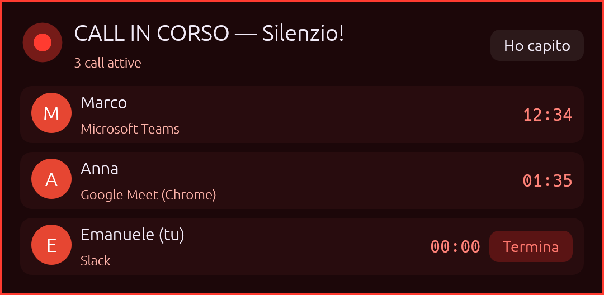
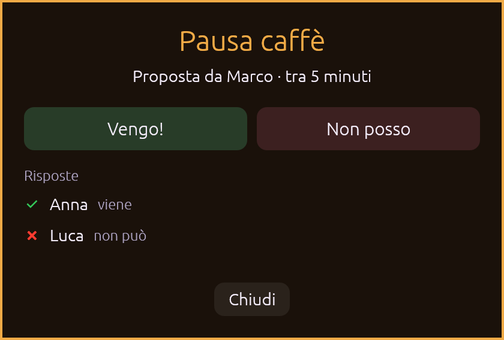

# DevLogica Tools

L'app dell'ufficio DevLogica, per **Windows** e **macOS**:

- **Avvisi di call**: quando un collega entra in call, sugli altri PC compare un avviso. Il riconoscimento è automatico per Teams, Slack, Zoom, Meet e le altre app.
- **Pausa caffè**: qualcuno la propone, gli altri rispondono *Vengo!* o *Non posso*, e tutti vedono le risposte in tempo reale.
- **Sfondi animati**: quattro sfondi DevLogica disegnati dalla scheda grafica, con supporto multimonitor.

È leggerissima: un unico eseguibile di pochi MB, senza server e senza account. I PC si parlano direttamente sulla rete dell'ufficio.

| Avviso di call | Pausa caffè |
|---|---|
|  |  |

---

## Installazione (per tutti)

Scarica l'ultima versione dalla pagina **Releases** del repository.

### Windows
1. Scarica `DevLogica-Tools-Windows.exe` e mettilo in una cartella stabile, per esempio `Documenti\DevLogica Tools`. Non serve installazione.
2. Al primo avvio SmartScreen mostra "Windows ha protetto il PC": clicca **Ulteriori informazioni**, poi **Esegui comunque**.
3. Se compare l'avviso del firewall, consenti l'accesso alle **reti private**. Senza questo permesso gli avvisi dei colleghi non arrivano.
4. Dal menu dell'icona attiva **Avvia all'accesso**.

### macOS
1. Scarica `DevLogica-Tools-macOS.zip`, estrailo e sposta **DevLogica Tools** in **Applicazioni**. Funziona sia su Apple Silicon sia su Intel.
2. Al primo avvio macOS blocca l'app: vai in **Impostazioni di Sistema → Privacy e sicurezza** e clicca **Apri comunque**.
   In alternativa, da Terminale:
   ```bash
   xattr -dr com.apple.quarantine "/Applications/DevLogica Tools.app"
   ```
3. Quando macOS chiede di **trovare dispositivi sulla rete locale**, rispondi **Consenti**.
4. Dal menu dell'icona attiva **Avvia all'accesso**.

Al primo avvio si apre la finestra **Impostazioni**: inserisci il tuo nome, cioè quello che vedranno i colleghi.

---

## Come si usa

L'app vive nell'icona della barra di sistema su Windows (vicino all'orologio) o della barra dei menu su macOS.
L'icona cambia in base allo stato:
- **pallino rosso**: c'è qualcuno in call;
- **pallino ambra**: c'è una pausa caffè in corso.

### Call
- **In automatico**: quando entri in call, i colleghi vengono avvisati da soli. Quando la chiudi, l'avviso sparisce.
- **A mano**: menu → *Sto entrando in call* / *Termina la mia call*.
- **Avviso ai colleghi**: riquadro "CALL IN CORSO — Silenzio!" con nome, app e durata, più un bordo rosso pulsante attorno agli schermi. *Ho capito* lo nasconde fino alla prossima call.
- **Suono**: due note morbide, con il volume regolabile nelle impostazioni.

### Pausa caffè
Dal menu scegli *Pausa caffè* → *Adesso* o *Tra 5, 10 o 15 minuti*. Ai colleghi compare l'invito con i pulsanti per rispondere.
Chi ha proposto la pausa vede le risposte e la chiude con *Fine pausa caffè*. In ogni caso la pausa si chiude da sola dopo 20 minuti.

### Sfondi animati
Si trovano nel menu → *Sfondi animati*, con queste opzioni:
- attivi o disattivati;
- stesso sfondo su ogni schermo, uno diverso per schermo, oppure uno solo esteso su tutti;
- fluidità e risoluzione (le versioni ridotte consumano meno);
- logo, pausa e sfondi personalizzati (vedi più sotto).

---

## Il riconoscimento automatico delle call

L'app guarda **quale app sta usando il microfono**. Non ascolta né registra niente, e non serve il permesso del microfono.
- **Windows**: legge la stessa informazione dell'icona del microfono nella barra di sistema, cioè quale programma lo sta usando.
- **macOS**: la chiede a CoreAudio.

**App riconosciute**: Microsoft Teams, Slack (anche gli huddle), Zoom, Webex, Discord, Skype, WhatsApp, Telegram, Signal, FaceTime, GoTo Meeting, RingCentral, 3CX. Sono riconosciuti anche i **browser**, per Google Meet, Teams web, Jitsi, Whereby e simili. Su Windows il titolo della finestra permette di scrivere, per esempio, "Google Meet (Chrome)".

**Tempi**:
- l'avviso parte dopo **4 secondi** di microfono aperto, così note vocali e prove audio non contano;
- la call si chiude dopo **10 secondi** di microfono chiuso, così un cambio di cuffie non la interrompe.

**Impostazioni**:
- *Automatico*, *Chiedi conferma* (compare "Sei entrato in call?") oppure *Disattivato*;
- *Considera call anche le app non riconosciute*;
- la sezione **Microfono in uso adesso** mostra in tempo reale cosa viene rilevato. Con **Ignora** escludi un'app, per esempio un registratore o un software di dettatura.

---

## Compatibilità con Call Alert

DevLogica Tools usa lo stesso protocollo di Call Alert: UDP broadcast sulla porta **47832**, con gli stessi messaggi.
Durante il passaggio, chi ha ancora Call Alert vede le call e le pause caffè di chi usa DevLogica Tools, e viceversa.

Le aggiunte sono ignorate da Call Alert:
- il nome dell'app di call;
- i minuti alla pausa caffè;
- il messaggio `CALL_ALIVE`, che fa sparire da sola la call di un PC spento o uscito dalla rete.

Quando tutti sono passati a DevLogica Tools, Call Alert si può disinstallare.

---

## Risoluzione dei problemi

**Gli avvisi non arrivano agli altri PC**
- Tutti devono essere sulla **stessa rete** (stesso router o switch). Alcune reti Wi-Fi "ospiti" isolano i dispositivi tra loro.
- **Windows**: deve essere consentito l'accesso alle reti private per *DevLogica Tools* (*Sicurezza di Windows → Firewall → Consenti app*).
- **macOS**: deve essere attivo il permesso *Rete locale* (*Impostazioni di Sistema → Privacy e sicurezza → Rete locale*).
- Nelle **Impostazioni** dell'app, alla voce *Colleghi in rete*, compare chi è stato trovato.

**La call non viene riconosciuta, o viene riconosciuta quando non dovrebbe**
Apri le **Impostazioni** durante la call: in *Microfono in uso adesso* vedi cosa rileva l'app. Se un'app di call manca dall'elenco, segnalala con il nome che compare lì e si aggiunge.

**Log**
- **Windows**: `%APPDATA%\DevLogica Tools\log.txt`
- **macOS**: `~/Library/Application Support/DevLogica Tools/log.txt`

Nella stessa cartella ci sono le impostazioni (`config.json`) e la cartella `sfondi` per gli sfondi personalizzati.
Al primo avvio vengono importate le impostazioni e gli sfondi di DevLogica Wallpaper, se presenti.

---

## Sviluppo

### Requisiti
- **Rust 1.95 o successivo** (https://rustup.rs). L'interfaccia usa egui 0.36.
- **Windows**: *Visual Studio Build Tools* con "Sviluppo di applicazioni desktop con C++".
- **macOS**: Xcode Command Line Tools (`xcode-select --install`).

```bash
cargo run --release      # avvia l'app
cargo test               # test di protocollo, logica e riconoscimento
```

Build locali:
- **Windows**: `.\packaging\windows\build.ps1`
- **macOS**: `./packaging/macos/build-app.sh universal`

### Pubblicare una nuova versione
La pipeline in `.github/workflows/release.yml` parte con un **tag di versione**:

```bash
git tag v1.1.0
git push origin v1.1.0
```

GitHub Actions compila Windows e macOS (app universale), esegue i test e pubblica la release con
`DevLogica-Tools-Windows.exe` e `DevLogica-Tools-macOS.zip`. La versione dell'app viene presa dal tag.

Le app installate controllano le release due volte al giorno. Quando ne trovano una nuova, nel menu compare *Scarica la nuova versione*.
Il repository da controllare viene inserito automaticamente durante la build su GitHub. Per una build locale si può impostare con la variabile `DEVLOGICA_REPO=utente/repo`.

Dalla scheda *Actions* si può anche lanciare la pipeline a mano (*Run workflow*). In quel caso fa solo la build: i file restano tra gli artefatti dell'esecuzione, senza creare una release.

### Strumenti utili
```bash
devlogica-tools --snapshot lame 3840 2160 20 lame.png     # immagine statica di uno sfondo
devlogica-tools --ui call anteprima.png                   # anteprima di una finestra (call, caffe, conferma, impostazioni)
```

### Struttura
```
src/main.rs          avvio, istanza unica, opzioni da riga di comando
src/app.rs           coordinatore: rete, call, caffè, finestre, menu, ritmi
src/office.rs        stato dell'ufficio: call e pausa caffè (con test)
src/net.rs           protocollo UDP compatibile con Call Alert (con test)
src/detect.rs        riconoscimento delle call dal microfono (con test)
src/ui.rs            finestre egui: avviso call, caffè, conferma, impostazioni, bordo rosso
src/tray.rs          menu e icona della barra di sistema
src/wallpaper.rs     sfondi animati per schermo e modalità multimonitor
src/render.rs        GPU (wgpu): shader degli sfondi e logo
src/sound.rs         suoni generati al volo
src/update.rs        controllo aggiornamenti dalle release di GitHub
src/platform/        Windows (desktop, microfono, avvio) e macOS (idem)
shaders/             sfondi in WGSL
esempi/onde.wgsl     esempio di sfondo personalizzato
```

### Sfondi personalizzati
Menu → *Sfondi animati* → *Apri cartella sfondi personalizzati*, copia lì un file `.wgsl` e poi scegli *Ricarica sfondi*.
Uno sfondo definisce due funzioni:
- `fn scene(p: vec2f) -> vec3f`, che dà il colore del pixel;
- `fn logo_layout() -> vec3f`, che dà posizione e larghezza del logo.

Puoi partire da `esempi/onde.wgsl`.
